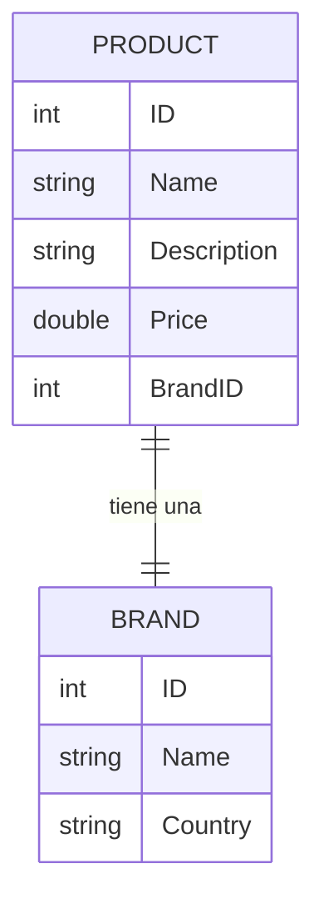

# Arquitectura del Proyecto OData Gateway

Este documento describe la arquitectura de la solución implementada, que actúa como un **API Gateway OData** orquestando llamadas a múltiples fuentes de datos simuladas (microservicios).

## Visión General

El proyecto está construido sobre **Spring Boot** y utiliza **Apache Olingo V4** para exponer una interfaz OData estándar. El componente central actúa como un middleware inteligente que traduce consultas OData (filtering, selection, expansion) en llamadas a servicios backend subyacentes.

### Diagrama de Alto Nivel

```mermaid
graph TD
    User[Cliente OData / Browser] -->|HTTP GET /OData.svc/...| ODataServlet[OData Servlet]
    ODataServlet -->|Request| Handler[OData Handler]
    Handler -->|Process| Processor[DemoEntityCollectionProcessor]
    
    subgraph "OData Gateway Layer"
        Processor
        EdmProvider[DemoEdmProvider / Metadata]
        Visitor[FilterExpressionVisitor]
    end
    
    subgraph "Data Layer (Simulated Microservices)"
        ProductService[Storage (Product Service)]
        BrandService[BrandStorage (Brand Service)]
    end
    
    Processor -->|Get Products| ProductService
    Processor -->|Get Brand by ID (if $expand)| BrandService
    Visitor -->|Evaluate Logic| Processor
```

## Entidades y Modelo de Datos

El modelo de datos expuesto por el servicio OData (`$metadata`) consta de dos entidades principales relacionadas.

### 1. Product (Producto)
Representa el inventario principal.
- **Microservicio Dueño**: `Storage.java`
- **Propiedades**: `ID`, `Name`, `Description`, `Price`, `BrandID`.
- **Relaciones**: Tiene una navegación `Brand` hacia la entidad Marca.

### 2. Brand (Marca)
Representa la información corporativa de los fabricantes.
- **Microservicio Dueño**: `BrandStorage.java`
- **Propiedades**: `ID`, `Name`, `Country`.

### Diagrama Entidad-Relación (ER)



## Flujos de Llamadas y Orquestación

El `DemoEntityCollectionProcessor` es el corazón de la orquestación. Decide dinámicamente qué servicios invocar basándose en la query string de OData.

### Escenario A: Consulta Simple de Productos
**Request**: `GET /Products`

1.  **OData Gateway** recibe la petición.
2.  Identifica que el EntitySet solicitado es `Products`.
3.  El `Processor` llama a `Storage.getProducts()`.
4.  **No** se realizan llamadas a `BrandStorage`.
5.  Se devuelve la lista de productos (el campo `Brand` en la respuesta estará ausente o solo como link).

### Escenario B: Consulta con Expansión (Orquestación)
**Request**: `GET /Products?$expand=Brand`

Este escenario desencadena el patrón "Hub & Spoke" o composición de datos.

1.  **OData Gateway** recibe la petición y detecta la opción `$expand`.
2.  El `Processor` llama a `Storage.getProducts()` para obtener la lista base.
3.  **Bucle de Enriquecimiento**:
    *   Itera sobre cada `Product` recuperado.
    *   Extrae el `BrandID`.
    *   **Llamada a Microservicio**: Invoca `BrandStorage.getBrandById(brandID)`.
    *   Crea una entidad `Brand` y la incrusta en el `Product` original.
4.  El serializador OData genera un JSON anidado combinando datos de ambas fuentes.

### Escenario C: Filtrado Avanzado
**Request**: `GET /Products?$filter=Price gt 100`

1.  El `Processor` obtiene **todos** los datos (en este ejemplo en memoria) de `Storage`.
2.  Utiliza el `ProductFilterExpressionVisitor` para recorrer el árbol de expresión del filtro.
3.  Evalúa cada producto contra la condición `Price > 100`.
4.  Descarta los productos que no cumplen antes de serializar la respuesta.

## Componentes Clave del Código

| Componente | Responsabilidad |
|------------|-----------------|
| **ODataConfig** | Configura el Servlet de Spring y registra los Beans de servicio. |
| **DemoEdmProvider** | Define el esquema (Metadata), tipos, propiedades y nombres. Es el "contrato" del API. |
| **DemoEntityCollectionProcessor** | Maneja la lógica de negocio. Es quien "pega" Olingo con los servicios de datos (`Storage`). |
| **ProductFilterExpressionVisitor** | Traduce las expresiones de filtro OData (String) a lógica Java ejecutable. |

## Futuras Mejoras Arquitectónicas

Para llevar esto a producción, se recomendaría:
1.  **Repository Real**: Reemplazar `Storage` y `BrandStorage` con llamadas `RestTemplate` o `WebClient` a APIs REST reales.
2.  **Traducción de Filtros a SQL**: En lugar de filtrar en memoria con el Visitor, traducir el árbol de expresión a criterios JPA/Hibernate QueryDSL para filtrar en base de datos.
3.  **Paginación**: Implementar `$top` y `$skip` para no traer la base de datos completa a memoria.
