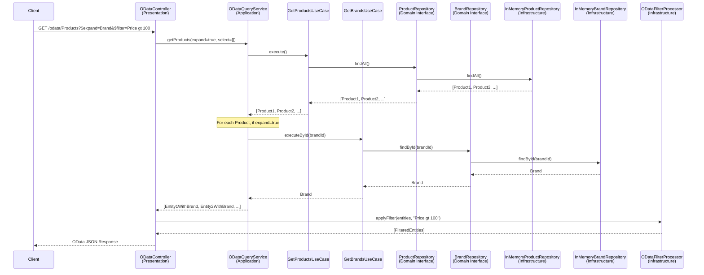
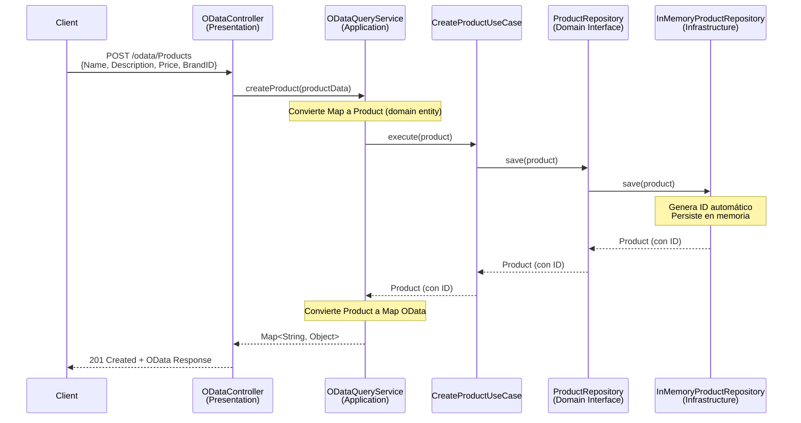

# Arquitectura Clean Code & Clean Architecture

## Visión General

Este proyecto implementa un **Gateway OData** usando **Spring Boot** con `@RestController`, siguiendo los principios de **Clean Architecture** y **Clean Code**.

## Estructura de Capas

```
src/main/java/com/example/odata/
│
├── 📦 domain/                          # CAPA DE DOMINIO (Core Business)
│   ├── model/                          # Entidades puras sin dependencias
│   │   ├── Product.java                # Entidad de negocio
│   │   └── Brand.java                  # Entidad de negocio
│   └── repository/                     # Contratos (Interfaces)
│       ├── ProductRepository.java      # Puerto de salida
│       └── BrandRepository.java        # Puerto de salida
│
├── 🎯 application/                     # CAPA DE APLICACIÓN (Use Cases)
│   ├── usecase/                        # Casos de uso específicos
│   │   ├── GetProductsUseCase.java     # Lógica de negocio: obtener productos
│   │   └── GetBrandsUseCase.java       # Lógica de negocio: obtener marcas
│   └── service/                        # Servicios de orquestación
│       └── ODataQueryService.java      # Orquestador principal de queries OData
│
├── 🔧 infrastructure/                  # CAPA DE INFRAESTRUCTURA (Detalles Técnicos)
│   ├── repository/                     # Implementaciones de repositorios
│   │   ├── InMemoryProductRepository.java  # Simula microservicio de productos
│   │   └── InMemoryBrandRepository.java    # Simula microservicio de marcas
│   └── odata/                          # Lógica específica de OData
│       └── ODataFilterProcessor.java   # Parser de filtros OData
│
└── 🌐 presentation/                    # CAPA DE PRESENTACIÓN (API REST)
    └── controller/
        └── ODataController.java        # Endpoints REST (@RestController)
```

## Diagrama de Dependencias (Clean Architecture)

```mermaid
graph TD
    subgraph Presentation["🌐 Presentation Layer"]
        Controller[ODataController<br/>@RestController]
    end
    
    subgraph Application["🎯 Application Layer"]
        QueryService[ODataQueryService]
        GetProducts[GetProductsUseCase]
        GetBrands[GetBrandsUseCase]
    end
    
    subgraph Domain["📦 Domain Layer<br/>(Core Business)"]
        Product[Product Entity]
        Brand[Brand Entity]
        ProductRepo[ProductRepository<br/>Interface]
        BrandRepo[BrandRepository<br/>Interface]
    end
    
    subgraph Infrastructure["🔧 Infrastructure Layer"]
        InMemProd[InMemoryProductRepository]
        InMemBrand[InMemoryBrandRepository]
        FilterProc[ODataFilterProcessor]
    end
    
    Controller --> QueryService
    Controller --> FilterProc
    QueryService --> GetProducts
    QueryService --> GetBrands
    GetProducts --> ProductRepo
    GetBrands --> BrandRepo
    ProductRepo -.implements.- InMemProd
    BrandRepo -.implements.- InMemBrand
    InMemProd --> Product
    InMemBrand --> Brand
    
    style Domain fill:#e1f5e1,stroke:#4CAF50,stroke-width:3px
    style Application fill:#e3f2fd,stroke:#2196F3,stroke-width:2px
    style Infrastructure fill:#fff3e0,stroke:#FF9800,stroke-width:2px
    style Presentation fill:#f3e5f5,stroke:#9C27B0,stroke-width:2px
```

## Principios Aplicados

### 1. **Dependency Rule** (Regla de Dependencia)
Las dependencias apuntan hacia adentro:
- **Presentation** → **Application** → **Domain**
- **Infrastructure** → **Domain**
- El dominio NO conoce nada de las capas exteriores

### 2. **Single Responsibility** (Responsabilidad Única)
Cada clase tiene una única razón para cambiar:
- `ODataController`: Solo maneja HTTP y parseo de query params
- `ODataQueryService`: Solo orquesta casos de uso
- `GetProductsUseCase`: Solo ejecuta la lógica de obtener productos
- `InMemoryProductRepository`: Solo maneja el acceso a datos

### 3. **Dependency Inversion** (Inversión de Dependencias)
Las capas superiores no dependen de implementaciones concretas:
```java
// ✅ UseCases dependen de abstracciones (interfaces)
public class GetProductsUseCase {
    private final ProductRepository repository; // Interface, NOT Implementation
}

// ✅ Infrastructure implementa las abstracciones
@Repository
public class InMemoryProductRepository implements ProductRepository { }
```

### 4. **Open/Closed** (Abierto/Cerrado)
Puedes cambiar la implementación sin tocar el código existente:
- Cambiar de `InMemoryXXXRepository` a `RestClientXXXRepository` sin modificar casos de uso
- Agregar nuevos filtros en `ODataFilterProcessor` sin tocar el controlador

## Flujo de una Request

### Ejemplo: `GET /odata/Products?$expand=Brand&$filter=Price gt 100`



## Decisiones de Diseño

### ¿Por qué @RestController en lugar de Servlet?

| Aspecto | Servlet (Olingo puro) | @RestController |
|---------|----------------------|-----------------|
| **Testabilidad** | Difícil (requiere mocks de HTTP) | Fácil (inyección de dependencias) |
| **Separación de Responsabilidades** | Todo mezclado | Capas claras |
| **Mantenibilidad** | Acoplado a Olingo | Framework-agnostic domain |
| **Flexibilidad** | Difícil cambiar infraestructura | Fácil intercambiar implementaciones |

### ¿Por qué In-Memory Repositories?

Simulan microservicios reales. En producción, se reemplazarían por:
```java
@Repository
public class RestClientProductRepository implements ProductRepository {
    private final RestTemplate restTemplate;
    
    @Override
    public List<Product> findAll() {
        return restTemplate.getForObject(
            "http://product-service/api/products", 
            ProductList.class
        );
    }
}
```

### Ejemplo POST: `POST /odata/Products` (Crear producto)



## Testing Strategy

### Unit Tests
```java
// Test del Use Case - NO requiere Spring
class GetProductsUseCaseTest {
    @Test
    void shouldReturnProducts() {
        ProductRepository mockRepo = mock(ProductRepository.class);
        GetProductsUseCase useCase = new GetProductsUseCase(mockRepo);
        // ...
    }
}
```

### Integration Tests
```java
@SpringBootTest
@AutoConfigureMockMvc
class ODataControllerIntegrationTest {
    @Test
    void shouldExpandBrandWhenRequested() {
        mockMvc.perform(get("/odata/Products?$expand=Brand"))
            .andExpect(jsonPath("$.value[0].Brand").exists());
    }
}
```

## Ventajas de esta Arquitectura

1. **Testeable**: Cada capa se puede testear aisladamente
2. **Mantenible**: Cambios en UI no afectan lógica de negocio
3. **Escalable**: Fácil agregar nuevas entidades o endpoints
4. **Framework Independent**: El core no depende de Spring ni Olingo
5. **Database Independent**: Fácil cambiar de in-memory a PostgreSQL
6. **Microservices Ready**: Los repositorios pueden fácilmente convertirse en clientes HTTP

## URLs de Ejemplo

```bash
# Productos simples (solo llama a ProductService)
GET http://localhost:8080/odata/Products

# Con expansión (llama a ProductService + BrandService)
GET http://localhost:8080/odata/Products?$expand=Brand

# Con selección de campos
GET http://localhost:8080/odata/Products?$select=Name,Price

# Con filtro
GET http://localhost:8080/odata/Products?$filter=Price gt 100

# Combinado
GET http://localhost:8080/odata/Products?$expand=Brand&$select=Name,Price&$filter=Price lt 200

# Marcas
GET http://localhost:8080/odata/Brands

# Metadata
GET http://localhost:8080/odata/$metadata

# Crear producto
POST http://localhost:8080/odata/Products
Content-Type: application/json
{
  "Name": "New Product",
  "Description": "Description here",
  "Price": 299.99,
  "BrandID": 1
}
```

## Próximos Pasos

Para producción, considera:
1. Agregar validación con Bean Validation
2. Implementar manejo global de excepciones (`@ControllerAdvice`)
3. Agregar autenticación/autorización (Spring Security)
4. Implementar caché (Redis) para reducir llamadas a microservicios
5. Agregar observabilidad (Micrometer, Sleuth)
6. Usar `RestTemplate`/`WebClient` para llamadas reales a microservicios
